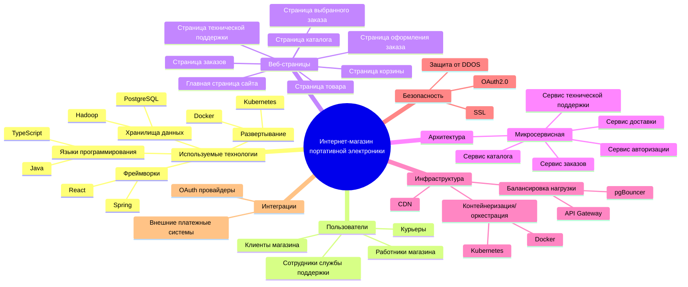
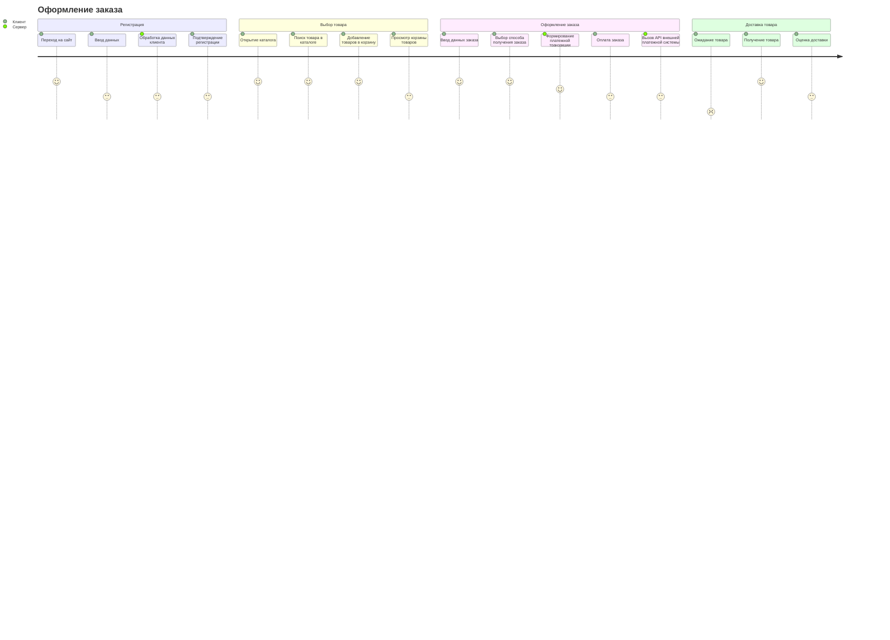
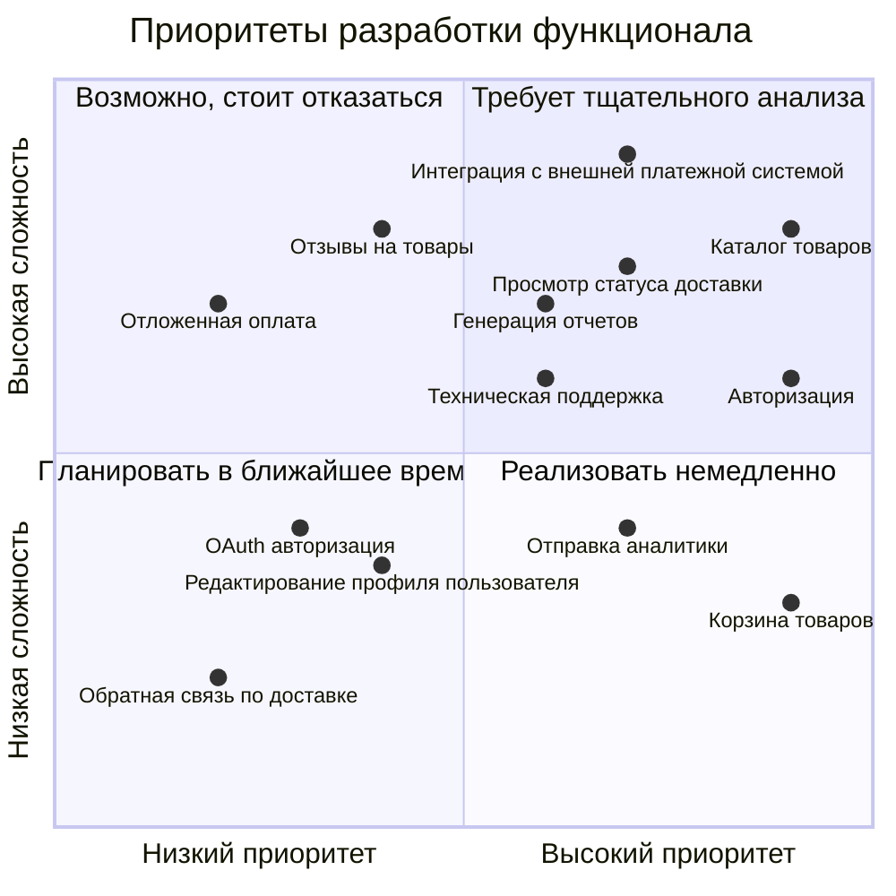
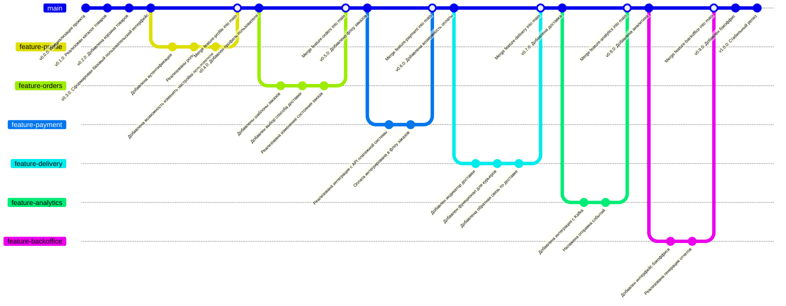

# Документирование информационной системы "Интернет-магазин портативной электроники"
Система представляет собой интернет-магазин с возможностью совершения заказов.

## 1. Структура функциональных возможностей (Mind Map)

### Описание:

Диаграмма показывает структуру функциональных возможностей системы "Интернет-магазин портативной электроники". От главного узла исходит следующие основные узлы (далее дано их краткое описание):
+ Используемые технологии - перечень технологий, используемых в проекте
+ Пользователи - перечень ролей пользователей
+ Веб-страницы - перечень основных страниц клиентской части системы
+ Архитектура - характеристика архитектуры системы
+ Инфраструктура - характеристика инфрастуктурной части
+ Безопасность - характеристика, применяемых техник безопасности
+ Интеграции - характеристика внешних систем, с которыми интегрирована система

## 2. Диаграмма путешествия пользователя (User Journey Diagram)

### Описание:

Customer Journey Map — это карта взаимодействия клиента с компанией или продуктом, от момента возникновения потребности и на всем пути пользования. В диаграмме представлены следующие секции:
+ Регистрация: включает этапы - переход на сайт, ввод данных, обработка данных клиента, подтверждение регистрации
+ Выбор товара: открытие каталога, поиск товара в каталоге, добавление товара в корзину, просмотр корзины товаров
+ Оформление заказа: ввод данных заказа, выбор способа получения заказа, формирование платежной транзакции, оплата заказа, вызов API внешней платежной системы
+ Доставка товара: ожидание товара, получение товара, оценка доставки

## 3. Квадрант-граф

### Описание:

Квадрант-граф позволяет определить приоритеты для задач. Точка на графике - определенная задача. На графике есть 2 оси и квадрата:
+ Ось X - сложность задачи (от простых к сложным)
+ Ось Y - приоритет задачи (от низкого к высокому)
+ Левый-верхний квадрат - задачи, от которых возможно стоит отказаться
+ Правый-верхний квадрат - задачи, требующие тщательного анализа (сложные, но приоритетные)
+ Левый-нижний квадрат - задачи, планируемые в ближайшее время (несложные и не приоритетные)
+ Правый-нижний квадрат - задачи, которые стоит реализовать в первую очередь

## 4. Гит-граф (Gitgraph)

### Описание:

Гитграф показывает процесс разработки системы, демонстрирует применяемый гит-флоу.
+ Основная ветка (main): стабильные версии
+ Фича-ветки: ветки, в которых разрабатываются отдельные фичи
+ Слияние: после окончания разработки фича-ветки сливаются в main-ветку, после merge-коммита создается еще один коммит с версией
